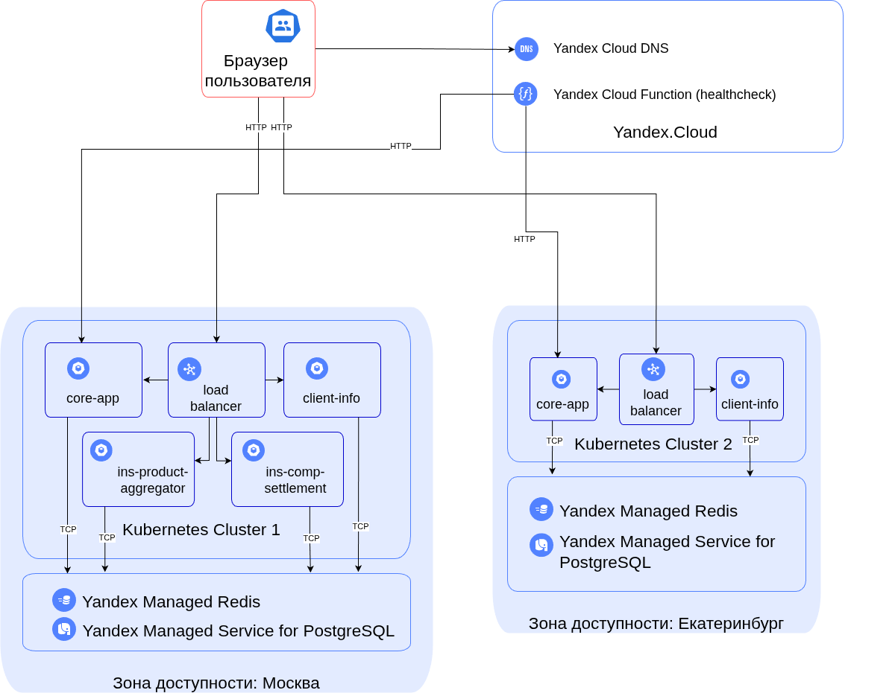

# Описание будущей архитектуры решения

## Краткий анализ текущего решения

На данный момент система *Insuretech* развернута в Kubernetes-кластере с единственным экземпляром БД PostgreSQL, запущенном на отдельной машине. БД является одним из главных узких мест, которое следует улучшить. Также необходимо добиться высокой отказоустойчивости и скорости работы во всех регионах РФ. Дополнительное требование -- ограничение по количеству запросов для корпоративных клиентов.

## Будущее решение

Предлагается развернуть два отдельных кластера Kubernetes в рахных регионах РФ: в Москве и Екатеринбурге. Все клиенты европейской части РФ будут обращаться в ЦОД в Москве, все кто за Уралом -- в Екатеринбург. Это позволит добиться достаточно высокой скорости работы системы, страницы будут загружаться быстро у всех клиентов.

Лучше всего, если все сервисы будут развернуты на мощностях облачного провайдера. В данном решении -- это Yandex. Облачный провайдер возьмет на себя сложности конфигурации, сопровождения и восстановления при сбоях. Также некоторые сервисы, такие как Yandex Cloud DNS, Yandex Cloud Functions, Yandex Application Load Balancer, Yandex Managed Service for PostgreSQL значительно упрощают разработку будущего масштабируемого и отказоустойчивого решения.

## Скорость загрузки страниц

Для того, чтобы пользователи в регионах, загружали страницы с той же скоростью, что и пользователи в Москве, будет развернут кластер в Екатеринбурге. При помощи Yandex Cloud DNS необходимо настроить гео-маршрутизацию, которая будет отдавать клиенту IP-адрес ближайшего кластера. Если Yandex Cloud DNS использовать нельзя, то можно воспользоваться Cloudflare или Amazone Route 53, которые умеют не только гео-маршрутизацию, но и динамически перенаправлять трафик в случае недоступности одного из кластеров.

В кластере Екатеринбурга будут развернуты микросервисы *core-app* и *client-info*, которые и принимают на себя основную часть взаимодействия с пользователем. Предлагается изспользовать Kubernetes HPA для горизонтального масштабирования pod-ов. Для начала можно поставить лимит потребления процессора и памяти 80%, а максимальное количество pod-ов -- 10; впоследствии лимиты возможно изменить при изменении средней и пиковой нагрузки.

Кроме того, в кластере Екатеринбурга будет развернут экземпляр Yandex Managed Service for PostgreSQL, который позволит уменьшить время получения данных из БД.

В случае, если Yandex Managed Service for PostgreSQL использовать нельзя (например, если k8s разворачивается on-premise), то можно было бы реализовать схему с репликацией. При этом, master был бы в Москве, и только он принимал бы запросы на запись. Реплика на чтение была бы в Екатеринбурге. Для реализации такой репликации пришлось бы использовать PostgreSQL Patroni, а сети кластеров соединить при помощи IPSec.

С учетом сравнительно небольшого объема данных в БД, шардирование здесь не требуется.

Дополнительно будет развернут Yandex Managed Redis, в котором можно будет кэшировать наиболее часто запрашиваемые данные.

## Отказоустойчивость

Достигается при помощи failover-стратегии Active-Active. Оба кластера на равных обслуживают клиентов. БД в режиме потоковой репликации передает данные в обе стороны, таким образом и в Екатеринбурге, и в Москве постоянно находится полная копия всех данных (хотя и с небольшой задержкой). Однако, в случае отказа кластера в Екатеринбурге, кластер в Москве примет на себя всю нагрузку в полном объеме. Обратное тоже верно, хотя и не полностью. В Екатеринбурге не будут развернуты сервисы *ins-product-aggregator*, *ins-comp-settlement*, и на время сбоя кластера в Москве их функционалность в системе будет не доступна. Тем не менее, эти сервисы не нужны для работы клиентов и могут быть вызваны после восстановления от сбоя.

В кластере в Москве сервисы *ins-product-aggregator* и *ins-comp-settlement* развернуты в единственном экземпляре, т.к. они задействуются для выполненния регулярных, но не частых работ и никак не взаимодействуют с клиентами.

## Healthcheck

Для того, чтобы Yandex Cloud DNS мог переключить траффик с одного кластера на другой, необходимо написать Yandex Cloud Function, которая будет делать следующее.

1) Для каждого из кластеров сервис *core-app* будет предоставлять эндпоинт */healthcheck*, по которому можно будет определить доступность кластера. Yandex Cloud Function будет раз в минуту опрашивать */healthcheck*.

2) В случае, если кластер окажется не доступен, Yandex Cloud Function заменит записи в Yandex Cloud DNS при помощи вызова API, и, таким образом, "завернет" весь оставшийся трафик на работоспособный кластер.

В случае использования Cloudflare или Amazon Route 53, облачной функции писать не нужно, данные DNS-провайдеры уже имеют нужные встроенные механизмы.

## Rate Limits

В каждом кластере будет развернут Yandex Application Load Balancer, который возьмет на себя роль API Gateway, и в числе прочего выполнит функцию rate limitter.  Если Yandex Application Load Balancer использовать нельзя, то в кластере можно развернуть любой API Gateway, например, Kong.

