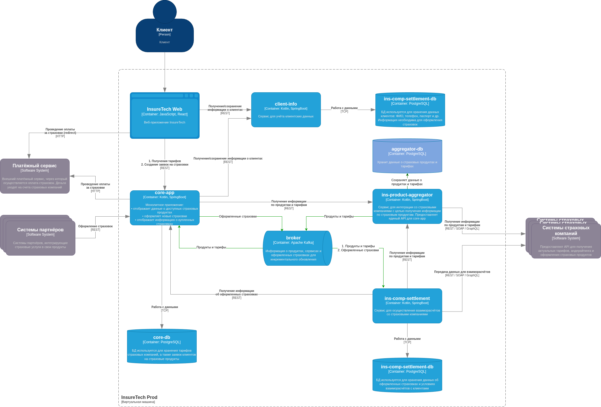

# Переход на Event-Driven архитектуру

## Анализ существующей архитектуры

Основная проблема существующей архитектуры -- синхроные запросы из *core-app* или *ins-comp-settlement* в *ins-product-aggregator* каждый раз, когда первым двум сервисам нужны данные о продуктах и тарифах из агрегатора. Агрегатор в свою чередь точно так же синхронно собирает данные из пяти других источников, и, разумеется, в ходе таких запросов могут быть сбои, приводящие к сбоям запросов из *core-app* и *ins-comp-settlement*.

Помимо "хрупкости" такого синхронного взаимодействия, оно ещё и очень медленное, потому что на каждый синхронный клиентский REST запрос о продуктах и тарифах система должна сделать несколько синхронных REST-запросов и ожидать от них ответов.

## Предлагаемое решение

### Страховые продукты и тарифы

1. В *ins-product-aggregator* следует добавить БД *aggregagor-db* для хранения всей информации, полученной от партнеров -- систем страховых компаний. В случае, если сервисы *core-app* и *ins-comp-settlement* будут запрашивать данные из *ins-product-aggregator*, система должна предоставить данные как раз из *aggregagor-db*, а не запрашивать их напрямую.
При этом, *ins-product-aggregator* должен раз в 15 минут делать запросы в системы страховых компаний и обновлять данные о страховых продуктах и тарифах. Полученные новые данные при помощи паттерна **Transaction Outbox** следует записать в *aggregagor-db*, а также отправить в *broker*.

2. Сервисы *core-app*, *ins-comp-settlement* во время холодного старта должны обратиться в *ins-product-aggregator* по REST и запросить всю информацию о страховых продуктах и тарифах и сохранить их в свои локальные БД. Далее, в своей работе они должны использовать информацию о страховых продуктах и тарифах только из своих локальных БД.

3. Сервисы *core-app*, *ins-comp-settlement* должны подписаться на события в *broker* и асинхронно обновлять в своих БД информацию о страховых продуктах и тарифах.

### Оформленные страховки

Аналогичная схема применяется и для оформленных страховок.

1. Во время холодного старта *ins-comp-settlement* по REST запрашивает в *core-app* всю информацию об оформленных страховках и сохраняет её в своей локальной БД.

2. Впоследствии *ins-comp-settlement* подписывается в *broker* на сообщения о новых оформленных страховках и асинхронно обновляет в своей БД эту информацию.

3. *core-app* публикует в *broker* сообщения о новых оформленных страховках при помощи паттерна **Transaction Outbox**.
