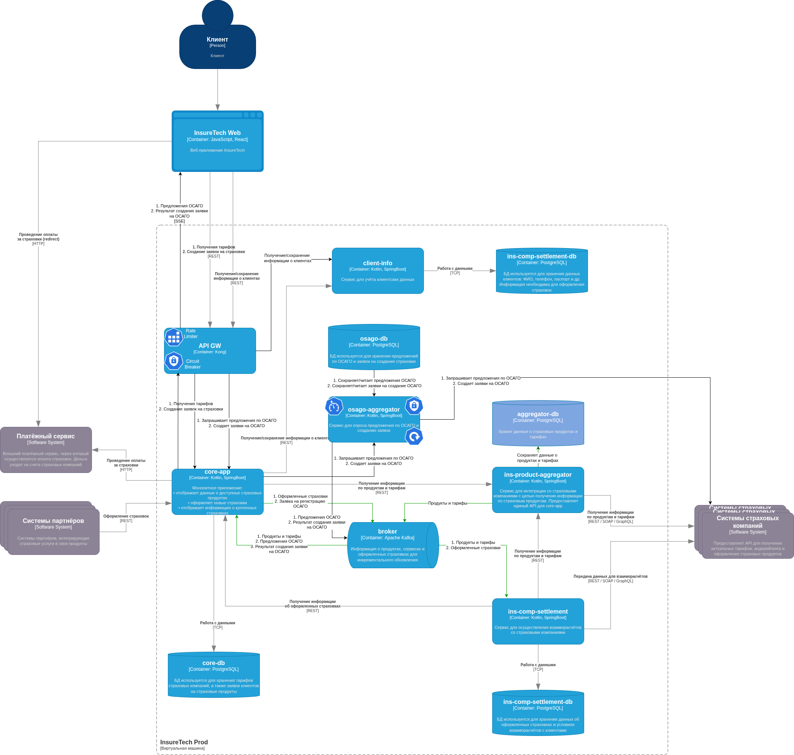

# Добавление агрегатора ОСАГО
## Анализ задачи
### Описание задачи

Необходимо предоставить следующие возможности:

1. Сделать запрос на предложение по ОСАГО на каждый конкретный автомобиль у каждого из поставщиков ОСАГО.
2. Создать заявку на ОСАГО на указанный автомобиль.

### Возможные проблемы

Поставщиков ОСАГО много, от 5 до 10 в ближайшем будущем. С каждым поставщиком приходится взаимодействовать при помощи синхронных REST-запросов. Каждый такой запрос может оказаться слишком медленным или вообще "сломаться".

Необходимо в режиме реального времени отображать предложения поставщиков ОСАГО в клиентском браузере.

## Описание решения

### Rate limitter

Приложение будет использоваться большим количеством пользователей, среди которых могут оказаться и недобросовестные клиенты, и хакеры. Следует ограничить количество запросов от одного клиента при помощи *rate limitter*, чтобы, во-первых, рост запросов не привел к DOS-атаке, "поглотившей" все доступные ресурсы кластера; а во-вторых, чтобы система не потребила все доступные ресурсы поставщиков страховок.

В качестве *rate limitter* предлагается испльзовать API GW *Kong*, позволяющий организовать ограничение на количество запросов по каждому конкретному аутентифицированному пользователю используя скользящее окно.

Предлагается, разрешить 1 пользователю до 30 запросов в минуту.

### Circuit breaker

На API GW *Kong* предлагается сконфигурировать *circuit breaker*, регулирующий доступ к микросервисам. В случае, если сервис не доступен, он быстро отдает статус код 503, а UI должен уметь отдавать информационную "заглушку" на время восстановления сервиса.

### Osago-aggregator и osago-db

Необходимо разработать отдельный микросервис со своей БД, инкапсулирующий знание о том, как взаимодействовать с поставщиками ОСАГО. Однако, в виду того, что эти взаимодействия медленные и ненадежные, необходимо воспользоваться *event-driven* подходом.

#### 1. Запрос на предложение от поставщиков ОСАГО

1. Клиент через веб-UI сделает запрос на ОСАГО для своего автомобиля. Запрос через API GW попадет на *core-app*.

2. Сервис *core-app* делает запрос в *osago-aggregator* на предложения от поставщиков ОСАГО. Однако, если это будет простой синхронный REST-запрос, то ожидать ответа придется слишком долго (т.к. *osago-aggregator* будет делать синхронные запросы к поставщикам). Поэтому *osago-aggregator* сгенерирует UUID для этого запроса, запустит асинхронный процесс по получению предложений ОСАГО от поставщиков и сразу же после запуска процесса отдаст UUID в *core-app*, который, в свою очередь, передаст его на UI.

3. Сервис *osago-aggregator* в параллельных потоках (например, при помощи Executors.newFixedThreadPool()) выполнит запросы к поставщикам ОСАГО. Эти запросы будут выполняться без механизма retry, но с механизмом timeout с ограничением в 60 секунд. Каждый запрос параметризируется сгенерированным на шаге 2 UUID.
Когда каждый из этих параллельных шагов завершается, он должен при помощи **Transaction Outbox** сделать запись в *osago-db* с UUID запроса и полученной информацией, а также послать это же сообщение в *broker*.

4. Поскольку UI необходимо в режиме реального времени выводить предложения поставщиков ОСАГО, возможны следующие механизмы:

- WebSockets 
- Server Sent Events
- Запросы по таймеру

Краткий анализ данных механизмов:

1) WebSocket-ы достаточно сложная, а главное -- хрупкая технология. Проходит не через все прокси, там есть и другие технические сложности, например, при разрыве соединение не восстанавливается автоматически, нет поддержки CORS и т.д. Кроме того, websocket привязывается к конкретному инстансу pod-а, что накладывает на архитектуру дополнительные ограничения и по факту делает архитектуру stateful.
WebSockets в сложных ситуациях подходит для разработки чатов и т.д., где нужна двунаправленная связь.

2) Server Sent Events -- протокол значительно проще, раотает прямо поверх HTTP/HTTPS, технических ограничений никаких особых нет. Позволяет организовать новостные ленты, т.к. является однонаправленным (от сервера к клиенту). Для нашей задачи подходит идеально.

3) Запросы по таймеру -- раз в 3-4 секунды запросить у сервера обновление информации. Является наиболее старым и простым подоходом, удобным, но не слишком "быстрым", т.к. минимальная задержка между обновлениями -- время ожидания таймера. Для нашей задачи также подходит хорошо.

##### Предлагаемое решение

Воспользуемся технологией SSE для доставки сообщений от *core-app* в UI. Для этого каждый SSE-обработчик создает свою локальную очередь событий, свой "почтовый ящик", куда сообщения будут приходить асинхронно из других потоков *core-app*. При этом *core-app* подписывается в *broker* на сообщения от *osago-aggregator*, извлекает оттуда UUID и передает эти сообщения в соответствующую локальную очередь. В случае перезагрузки страницы UI может запросить через *core-app <--> osago-aggregator* все предложения по своему UUID и снова подписаться на SSE.

Для безопасности, все события должны содержать *user id* и отдаваться только соответствующему пользователю.

#### 2. Оформление заявки ОСАГО

Сам вызов на оформление заявки у поставщика ОСАГО может оказаться слишком длительным или "сломаться". Чтобы не реализовывать сложные механизмы retry, предлагается следующая архитектура решения.

1. UI посылает на *core-app* запрос на создание ОСАГО. *core-app* возвращает UUID этого запроса. UI подписывается на SSE и ждет результата создания заявки.

2. *core-app* получает запрос на создание заявки. Генерирует UUID, возвращает его на UI и регистрирует заявку в *broker*. Открывает канал SSE, чтобы послать туда результат выполнения заявки. Сам подписывается на сообщения из *broker* и ожидает результат создания заявки.

3. *osago-aggregator* подписывается на топик, куда попадают заявки на создание ОСАГО. Получив заявку, *osago-aggregator* выполняет соответствующий запрос и посылает в *broker* результат этого запроса.

Поскольку *broker* очень отказоустойчив, оформление заявок на ОСАГО с использованием *broker* избавит программистов от необходимости писать сложные механизмы try-retry, которые пригодятся при отказе *osago-aggregator* либо поставщиков ОСАГО.
